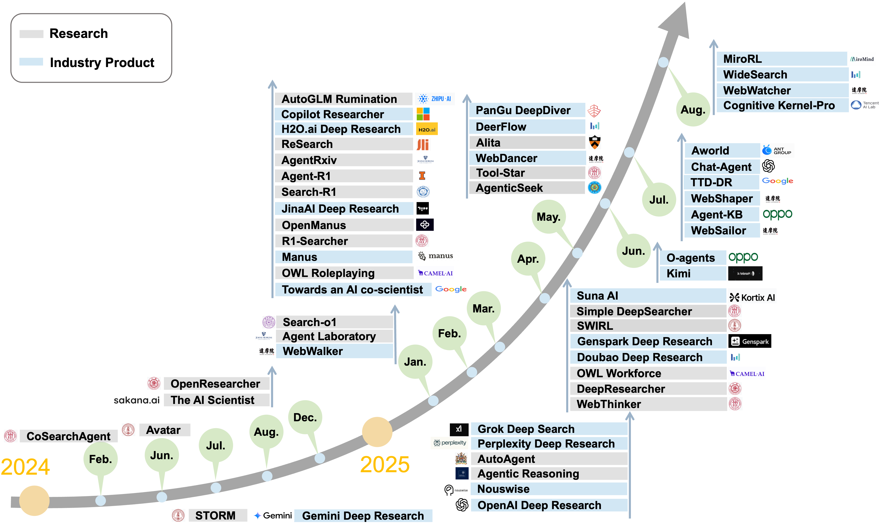
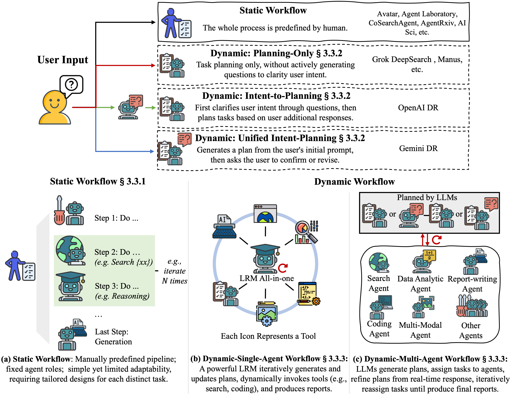

# Awesome Deep Research Agent

We maintain a curated collection of papers exploring the path towards **Deep Research (DR) Agents**, focusing on formulating core concepts and mapping the research landscape.

⌛️ **Coming soon – Version 2!** We’re continuously compiling and updating cutting‑edge insights. Feel free to suggest any related work you find valuable!

<p align="center">
   
</p>
<p align="center">
Build a digital assistant on your screen. Generated by <a href="https://openai.com/index/dall-e-3/">DALL-E-3</a>.
</p>

**WELCOME CONTRIBUTE!**

🔥 This project is actively maintained, and we welcome your contributions. If you have any suggestions, such as missing papers or information, please feel free to open an issue or submit a pull request.

## Our Works Towards DR Agents

✨✨✨ **[Deep Research Agents: A Systematic Examination And Roadmap](https://arxiv.org/abs/2506.18096)**





# Awesome Papers

<font size=5><center><b> Table of Contents </b> </center></font>
  
1. [Search Engine Integration](#search-engine-api-vs-browser)  
2. [Tool Use](#tool-use)  
3. [Architecture & Workflow](#architecture--workflow)  
   - [Static Workflow](#static-workflow)  
   - [Dynamic Single‑Agent Workflow](#dynamic-single-agent-workflow)  
   - [Dynamic Multi‑Agent Workflow](#dynamic-multi-agent-workflow)  
4. [Tuning Methods](#tuning-methods)  
5. [Industrial Applications](#industrial-applications)  
6. [Benchmarks for DR Agents](#benchmarks-for-dr-agents)  


## Search Engine Integration <a id="search-engine-api-vs-browser"></a>

<details open>
<summary>📊 Search Engine · API vs Browser Comparison</summary>

| Legend | ✔️ Primary focus | 🟫 Secondary/minor focus | — Not present |
| ------ | :--------------: | :----------------------: | :-----------: |

| DR Agent                               | API | Browser | GAIA | HLE | QA                                                             | Base Model                                                       |
| -------------------------------------- | :-: | :-----: | :--: | :-: | -------------------------------------------------------------- | ---------------------------------------------------------------- |
| Avatar                                 |  🟫 |    —    |   —  |  —  | Stark                                                          | Claude-3-Opus, GPT-4                                             |
| CoSearch-Agent                         |  ✔️ |    —    |   —  |  —  | —                                                              | GPT-3.5-turbo                                                    |
| MMAC-Copilot                           |  ✔️ |    —    |  ✔️  |  —  | —                                                              | GPT-3.5, GPT-4                                                   |
| Storm                                  |  🟫 |    —    |   —  |  —  | FreshWiki                                                      | GPT-3.5-turbo                                                    |
| OpenResearcher                         |  ✔️ |    —    |   —  |  —  | Private QA                                                     | DeepSeek-V2-Chat                                                 |
| The AI Scientist                       |  ✔️ |    —    |   —  |  —  | MLE-Bench                                                      | GPT-4o, o1-mini, o1-preview                                      |
| Gemini DR                              |  ✔️ |    ✔️   |   —  |  ✔️ | GPQA                                                           | Gemini-2.0-Flash                                                 |
| Agent Laboratory                       |  ✔️ |    —    |   —  |  —  | MLE-Bench                                                      | GPT-4o, o1-preview                                               |
| Search-o1                              |  ✔️ |    —    |   —  |  —  | GPQA·NQ·TriviaQA                                               | QwQ-32B-preview                                                  |
| WebWalker                              |  —  |    —    |   —  |  —  | WebWalkerQA                                                    | GPT-4o, Qwen-2.5                                                 |
| Agentic Reasoning                      |  ✔️ |    —    |   —  |  —  | GPQA                                                           | DeepSeek-R1, Qwen2.5                                             |
| AutoAgent                              |  —  |    ✔️   |  ✔️  |  —  | —                                                              | Claude-Sonnet-3.5                                                |
| Grok DeepSearch                        |  ✔️ |    ✔️   |   —  |  —  | GPQA                                                           | Grok 3                                                           |
| OpenAI DR                              |  —  |    ✔️   |  ✔️  |  ✔️ | ✔️                                                             | GPT-o3                                                           |
| Perplexity DR                          |  ✔️ |    🟫   |   —  |  ✔️ | SimoleQA                                                       | Flexible                                                         |
| Towards an AI Co-Scientist             |  ✔️ |    —    |   —  |  —  | GPQA                                                           | Gemini 2.0                                                       |
| Nouswise                               |  —  |    —    |   —  |  —  | —                                                              | —                                                                |
| AgentRxiv                              |  ✔️ |    —    |   —  |  —  | GPQA·MedQA                                                     | GPT-4o-mini                                                      |
| Agent-R1                               |  ✔️ |    —    |   —  |  —  | HotpotQA                                                       | Qwen2.5-1.5B-Inst                                                |
| AutoGLM Rumination                     |  —  |    ✔️   |   —  |  —  | GPQA                                                           | GLM-Z1-Air                                                       |
| Copilot Researcher                     |  —  |    ✔️   |   —  |  —  | —                                                              | o3-mini                                                          |
| H2O.ai DR                              |  ✔️ |    ✔️   |  ✔️  |  —  | —                                                              | h2ogpt-oasst1-512-12b                                            |
| Manus                                  |  ✔️ |    ✔️   |   —  |  —  | —                                                              | Claude3.5, GPT-4o                                                |
| OpenManus                              |  ✔️ |    ✔️   |   —  |  —  | —                                                              | Claude3.5, GPT-4o                                                |
| OWL                                    |  ✔️ |    ✔️   |  ✔️  |  —  | —                                                              | DeepSeek-R1, Gemini-2.5-Pro, GPT-4o                              |
| R1-Searcher                            |  🟫 |    —    |   —  |  —  | 2WikiMultiHopQA, HotpotQA                                      | Llama3.1-8B-Inst, Qwen2.5-7B                                     |
| ReSearch                               |  🟫 |    —    |   —  |  —  | 2WikiMultiHopQA, HotpotQA                                      | Qwen2.5-7B, Qwen2.5-7B-Inst                                      |
| Search-R1                              |  🟫 |    —    |   —  |  —  | 2WikiMultiHopQA, HotpotQA, NQ, TriviaQA                        | Llama3.2-3B, Qwen2.5-3B/7B                                       |
| DeepResearcher                         |  —  |    ✔️   |   —  |  —  | HotpotQA, NQ, TriviaQA                                         | Qwen2.5-7B-Inst                                                  |
| Genspark Super Agent                   |  ✔️ |    ✔️   |  ✔️  |  —  | —                                                              | *Mixture of 9 LLMs*                                              |
| WebThinker                             |  ✔️ |    —    |  ✔️  |  ✔️ | GPQA, [WebWalkerQA](https://arxiv.org/pdf/2501.07572)          | QwQ-32B                                                          |
| SWIRL                                  |  —  |    ✔️   |   —  |  —  | HotQA, BeerQA                                                  | Gemma 2-27B                                                      |
| SimpleDeepSearcher                     |  —  |    ✔️   |  ✔️  |  —  | 2WikiMultiHopQA                                                | Qwen-2.5-7B/32B-In, DeepSeek-D-Qwen-2.5-32B, QwQ-32B             |
| Suna AI                                |  ✔️ |    ✔️   |   —  |  —  | —                                                              | GPT-4o, Claude                                                   |
| AgenticSeek                            |  —  |    ✔️   |   —  |  —  | —                                                              | GPT-4o, DeepSeek-R1, Claude                                      |
| Alita                                  |  ✔️ |    ✔️   |  ✔️  |  —  | PathVQA                                                        | GPT-4o, Claude-Sonnet-4                                          |
| DeerFlow                               |  ✔️ |    —    |   —  |  —  | —                                                              | Doubao-1.5-Pro-32k, DeepSeek-R1, GPT-4o, Qwen                    |
| PANGU DEEPDIVER                        |  ✔️ |    —    |   —  |  —  | C-SimpleQA, HotpotQA, ProxyQA                                  | Pangu-7B-Reasoner                                                |
| WebDancer                              |  ✔️ |    —    |  ✔️  |  —  | GAIA, [WebWalkerQA](https://arxiv.org/pdf/2501.07572)          | Qwen-2.5, QwQ-32B, DeepSeek-R1, GPT-4o                           |
| O-agents                               |  ✔️ |    —    |  ✔️  |  —  | —                                                              | GPT-4o, GPT-4.1, Claude-3.7-Sonnet, DeepSeek-R1, Gemini-2.5      |
| Kimi-Researcher                        |  ✔️ |    ✔️   |   —  |  ✔️ | SimpleQA                                                       | Kimi k1.5/k2                                                     |
| WebSailor                              |  ✔️ |    —    |  ✔️  |  —  | SimpleQA                                                       | Qwen-2.5                                                         |
| Agent-KB                               |  ✔️ |    —    |  ✔️  |  —  | SWE-bench                                                      | GPT-4o, GPT-4.1, Claude-3.7-Sonnet, o3-mini, Qwen-3, DeepSeek-R1 |
| WebShaper                              |  ✔️ |    —    |  ✔️  |  —  | WebWalkerQA                                                    | Qwen-2.5, QwQ-32B                                                |
| Deep Researcher with Test-Time Diffusion |  ✔️ |    —    |  ✔️  |  ✔️ | —                                                              | Gemini-2.5-Pro                                                   |
| ChatGPT-Agent                          |  —  |    —    |   —  |  —  | —                                                              | —                                                                |
| AWorld                                 |  ✔️ |    ✔️   |  ✔️  |  —  | HotpotQA                                                       | Gemini-2.5-Pro, GPT-4o                                           |
| Cognitive Kernel-Pro                   |  ✔️ |    ✔️   |  ✔️  |  —  | AgentWebQA, WebWalkerQA, Multi-hop URLQA, DocBench, TableBench | Claude-3.7-Sonnet, CK-Pro-8B                                     |
| WebWatcher                             |  ✔️ |    —    |   —  |  ✔️ | Browsercom-VL, LiveVQA, MMSearch                               | Qwen-2.5-VL-32B                                                  |
| WideSearch                             |  ✔️ |    —    |   —  |  —  | WideSearch                                                     | DeepSeek-R1, Doubao-Seed-1.6, Claude Sonnet 4, Gemini-2.5-Pro    |
| MiroRL                                 |  ✔️ |    —    |  ✔️  |  —  | —                                                              | Qwen3-14B                                                        |


</details>

## Tool Use <a id="tool-use"></a>

<details open>
<summary>📊 Tool Use Capabilities Comparison</summary>

| Legend | ✔️ Involved | 🟫 Non Disclosure | — Not present |
|--------|:-----------:|:-----------------:|:-------------:|

| DR Agent | Code Interp. | Data Analytics | Multimodal | Release |
|---|:-:|:-:|:-:|:-:|
| CoSearchAgent | — | ✔️ | — | Feb-2024 |
| Storm | ✔️ | — | — | Jul-2024 |
| The AI Scientist | ✔️ | — | — | Aug-2024 |
| Agent Laboratory | ✔️ | — | — | Jan-2025 |
| Agentic Reasoning | ✔️ | — | — | Feb-2025 |
| AutoAgent | ✔️ | — | ✔️ | Feb-2025 |
| Genspark DR | ✔️ | ✔️ | ✔️ | Feb-2025 |
| Grok DeepSearch | ✔️ | ✔️ | ✔️ | Feb-2025 |
| OpenAI DR | ✔️ | ✔️ | ✔️ | Feb-2025 |
| Perplexity DR | ✔️ | ✔️ | ✔️ | Feb-2025 |
| Towards an AI co-scientist | — | ✔️ | ✔️ | Feb-2025 |
| Agent-R1 | ✔️ | — | — | Mar-2025 |
| AutoGLM Romination | ✔️ | — | ✔️ | Mar-2025 |
| Copilot Researcher | ✔️ | ✔️ | 🟫 | Mar-2025 |
| Manus | ✔️ | ✔️ | ✔️ | Mar-2025 |
| OpenManus | ✔️ | ✔️ | — | Mar-2025 |
| OWL | ✔️ | ✔️ | ✔️ | Mar-2025 |
| H2O.ai DR | ✔️ | ✔️ | ✔️ | Mar-2025 |
| Genspark Super Agent | ✔️ | ✔️ | ✔️ | Apr-2025 |
| WebThinker | ✔️ | — | — | Apr-2025 |
| Suna Ai | ✔️ | ✔️ | — | Apr-2025 |
| Tool-Star | ✔️ | ✔️ | — | May-2025 |
| AgenticSeek | ✔️ | ✔️ | — | May-2025 |
| Alita | ✔️ | 🟫 | 🟫 | May-2025 |
| DeerFlow | ✔️ | ✔️ | — | May-2025 |
| O-agents | ✔️ | ✔️ | ✔️ | Jun-2025 |
| Kimi-Researcher | ✔️ | ✔️ | — | Jun-2025 |
| Agent-KB | ✔️ | ✔️ | ✔️ | Jul-2025 |
| AWorld | ✔️ | ✔️ | ✔️ | Jul-2025 |
| Cognitive Kernel-Pro | ✔️ | ✔️ | ✔️ | Aug-2025 |
| WebWatcher | ✔️ | ✔️ | ✔️ | Aug-2025 |
| MiroRL | ✔️ | ✔️ | — | Aug-2025 |


</details>

## Architecture & Workflow <a id="architecture--workflow"></a>

<p align="center">
  
</p>

### Static Workflow <a id="static-workflow"></a>
+ **[AvaTaR: Optimizing LLM Agents for Tool Usage via Contrastive Reasoning](https://arxiv.org/abs/2406.11200)**  [](https://github.com/zou-group/avatar)
+ **[Agent Laboratory: Using LLM Agents as Research Assistants](https://arxiv.org/abs/2501.04227)**  [](https://github.com/SamuelSchmidgall/AgentLaboratory)
+ **[CoSearchAgent: A Lightweight Collaborative Search Agent with Large Language Models](https://arxiv.org/abs/2402.06360)**  [](https://github.com/pygongnlp/CoSearchAgent)
+ **[AgentRxiv: Towards Collaborative Autonomous Research](https://agentrxiv.github.io/)**  [](https://github.com/SamuelSchmidgall/AgentLaboratory)
+ **[The AI Scientist: Towards Fully Automated Open-Ended Scientific Discovery](https://arxiv.org/abs/2408.06292)**  [](https://github.com/SakanaAI/AI-Scientist)
+ **[Nouswise](https://nouswise.com/homepage)**

### Dynamic Single‑Agent Workflow <a id="dynamic-single-agent-workflow"></a>
+ **[OpenResearcher: Unleashing AI for Accelerated Scientific Research](https://arxiv.org/abs/2408.06941)**  [](https://github.com/GAIR-NLP/OpenResearcher)
+ **[Search‑o1: Agentic Search‑Enhanced Large Reasoning Models](https://arxiv.org/abs/2501.05366)**  [](https://github.com/sunnynexus/Search-o1)
+ **[Agentic Reasoning: Reasoning LLMs with Tools for the Deep Research](https://arxiv.org/abs/2502.04644)**  [](https://github.com/theworldofagents/Agentic-Reasoning)
+ **[Agent‑R1: Training Powerful LLM Agents with End‑to‑End Reinforcement Learning](https://github.com/0russwest0/Agent-R1)**  [](https://github.com/0russwest0/Agent-R1)
+ **[R1‑Searcher: Incentivizing the Search Capability in LLMs via Reinforcement Learning](https://arxiv.org/abs/2503.05592)**  [](https://github.com/RUCAIBox/R1-Searcher)
+ **[Search‑R1: Training LLMs to Reason and Leverage Search Engines with Reinforcement Learning](https://arxiv.org/abs/2503.09516)**  [](https://github.com/PeterGriffinJin/Search-R1)
+ **[DeepResearcher: Scaling Deep Research via Reinforcement Learning in Real‑world Environments](https://arxiv.org/abs/2504.03160)**  [](https://github.com/GAIR-NLP/DeepResearcher)
+ **[WebThinker: Empowering Large Reasoning Models with Deep Research Capability](https://arxiv.org/abs/2504.21776)**  [](https://github.com/RUC-NLPIR/WebThinker)
+ **[Open AI Deep Research](https://openai.com/index/introducing-deep-research/)**
+ **[Google Gemini Deep Research](https://gemini.google/overview/deep-research/)**
+ **[Grok Deep Search](https://x.ai/news/grok-3)**
+ **[Perplexity Deep Research](https://www.perplexity.ai/hub/blog/introducing-perplexity-deep-research)**
+ **[ReSearch: Learning to Reason with Search for LLMs via Reinforcement Learning](https://github.com/Agent-RL/ReSearch)**  [](https://github.com/Agent-RL/ReSearch)
+ **[Synthetic Data Generation & Multi-Step RL for Reasoning & Tool Use](https://arxiv.org/abs/2504.04736)**
+ **[H2O.ai Deep Research](https://h2o.ai/)**
+ **[SimpleDeepSearcher: Deep Information Seeking via Web-Powered Reasoning Trajectory Synthesis](https://github.com/RUCAIBox/SimpleDeepSearcher)** [](https://github.com/RUCAIBox/SimpleDeepSearcher)
+ **[WebDancer: Towards Autonomous Information Seeking Agency](https://github.com/Alibaba-NLP/WebAgent)** [](https://github.com/Alibaba-NLP/WebAgent)
+ **[Synthetic Data Generation & Multi‑Step RL for Reasoning & Tool Use](https://arxiv.org/abs/2504.04736)**
+ **[SimpleDeepSearcher: Deep Information Seeking via Web‑Powered Reasoning Trajectory Synthesis](https://github.com/RUCAIBox/SimpleDeepSearcher)**  [](https://github.com/RUCAIBox/SimpleDeepSearcher)
+ **[Suna AI](https://github.com/kortix-ai/suna)**  [](https://github.com/kortix-ai/suna)
+ **[Alita: Generalist Agent Enabling Scalable Agentic Reasoning with Minimal Predefinition and Maximal Self‑Evolution](https://arxiv.org/pdf/2505.20286)**
+ **[AgenticSeek](https://github.com/Fosowl/agenticSeek)**  [](https://github.com/Fosowl/agenticSeek)
+ **[AutoGLM Rumination](https://autoglm-research.zhipuai.cn/)**
+ **[O-agents](https://github.com/OPPO-PersonalAI/OAgents)** [](https://github.com/OPPO-PersonalAI/OAgents)
+ **[WebDancer](https://github.com/Alibaba-NLP/WebAgent)** [](https://github.com/Alibaba-NLP/WebAgent)
+ **[WebSailor](https://github.com/Alibaba-NLP/WebAgent)** [](https://github.com/Alibaba-NLP/WebAgent)
+ **[WebShaper](https://github.com/Alibaba-NLP/WebAgent)** [](https://github.com/Alibaba-NLP/WebAgent)
+ **[Kimi-Researcher](https://github.com/MoonshotAI/Kimi-Researcher)** [](https://github.com/MoonshotAI/Kimi-Researcher)
+ **[Deep Researcher with Test-Time Diffusion](https://arxiv.org/abs/2507.16075)**
+ **[WebWatcher](https://github.com/Alibaba-NLP/WebAgent)** [](https://github.com/Alibaba-NLP/WebAgent)
+ **[Chat-Agent](https://openai.com/zh-Hans-CN/index/introducing-chatgpt-agent/)**
+ **[Cognitive Kernel-Pro](https://github.com/Tencent/CognitiveKernel-Pro)** [](https://github.com/Tencent/CognitiveKernel-Pro)
+ **[Tool-Star](https://github.com/dongguanting/Tool-Star)** [](https://github.com/dongguanting/Tool-Star)
+ **[MiroRL](https://github.com/MiroMindAI/MiroRL)** [](https://github.com/MiroMindAI/MiroRL)


### Dynamic Multi‑Agent Workflow <a id="dynamic-multi-agent-workflow"></a>
+ **[Assisting in Writing Wikipedia-like Articles From Scratch with Large Language Models](https://arxiv.org/abs/2402.14207)**
+ **[AutoAgent: A Fully-Automated and Zero-Code Framework for LLM Agents](https://arxiv.org/pdf/2502.05957)** [](https://github.com/HKUDS/AutoAgent)
+ **[OpenManus](https://github.com/mannaandpoem/OpenManus)** [](https://github.com/mannaandpoem/OpenManus)
+ **[Manus](https://manus.im/)**
+ **[OWL](https://github.com/camel-ai/owl)** [](https://github.com/camel-ai/owl)
+ **[PANGU DEEPDIVER: ADAPTIVE SEARCH INTENSITY SCALING VIA OPEN-WEB REINFORCEMENT LEARNING](https://arxiv.org/pdf/2505.24332)**
+ **[H2O.ai Deep Research](https://h2o.ai/)**
+ **[Copilot Researche](https://www.microsoft.com/en-us/microsoft-365/blog/2025/03/25/introducing-researcher-and-analyst-in-microsoft-365-copilot/)**
+ **[Genspark Super Agent](https://www.genspark.ai/)**
+ **[DeerFlow](https://github.com/bytedance/deer-flow)** [](https://github.com/bytedance/deer-flow)
+ **[MMAC-Copilot](https://arxiv.org/abs/2404.18074)**
+ **[Agent KB](https://github.com/OPPO-PersonalAI/Agent-KB)** [](https://github.com/OPPO-PersonalAI/Agent-KB)
+ **[Towards an AI co-scientist](https://arxiv.org/abs/2502.18864)**
+ **[WebWalker](https://github.com/Alibaba-NLP/WebWalker)** [](https://github.com/Alibaba-NLP/WebWalker)
+ **[AWorld](https://github.com/inclusionAI/AWorld)** [](https://github.com/inclusionAI/AWorld)
+ **[Atom-Searcher](https://github.com/antgroup/Research-Venus)** [](https://github.com/antgroup/Research-Venus)

## Tuning Methods <a id="tuning-methods"></a>

<details open>
<summary>📊 Tuning Methods Comparison</summary>

| Legend | ✔️ Implemented | 🟫 Details Unknown | — Not present |
|--------|:--------------:|:------------------:|:-------------:|

| DR Agent | SFT | RL | Base Model | Data | Reward Design |
|---|:-:|:-:|---|---|---|
| Gemini DR | 🟫 | 🟫 | Gemini-2.0-Flash | — | 🟫 |
| WebWalker | — | — | GPT-4o, Qwen-2.5 (7–72B) | WebWalkerQA | — |
| Grok DeepSearch | — | 🟫 | Grok 3 | — | 🟫 |
| OpenAI DR | — | 🟫 | GPT-o3 | — | 🟫 |
| Agentic Reasoning | ✔️ | — | DeepSeek-R1, Qwen2.5 | GPQA | Rule-Outcome |
| AutoAgent | — | ✔️ | Claude-Sonnet-3.5 | — | — |
| Towards an AI co-scientist | — | — | Gemini 2.0 | — | — |
| Agent-R1 | — | PPO · Reinforce++ · GRPO | Qwen2.5-1.5B-Inst | HotpotQA | Rule-Outcome |
| AutoGLM Rumination | 🟫 | 🟫 | GLM-Z1-Air | — | 🟫 |
| H2O.ai DR | ✔️ | 🟫 | h2ogpt-oasst1-512-12b | — | 🟫 |
| Copilot Researcher | 🟫 | 🟫 | o3-mini | — | — |
| ReSearch | — | GRPO | Qwen2.5-7B-Inst · Qwen2.5-32B-Inst | 2WikiMultiHopQA | Rule-Outcome |
| R1-Searcher | ✔️ | Reinforce++ · GRPO | Qwen2.5-7B-Inst / LLaMA-3.1-8B-Inst | 2WikiMultiHopQA · HotpotQA | Rule-Outcome |
| Search-R1 | ✔️ | PPO · GRPO | Qwen2.5-3B/7B · LLaMA3.2-3B-Inst | NQ · HotpotQA | Rule-Outcome |
| Nouswise | 🟫 | 🟫 | Nouswise | — | 🟫 |
| DeepResearcher | — | GRPO | Qwen2.5-7B-Inst | NQ · HotpotQA | Rule-Outcome |
| Genspark Super Agent | — | 🟫 | Mixture of Agents | — | 🟫 |
| WebThinker | ✔️ | Iterative Online DPO | QwQ-32B | Expert Dataset | Rule-Outcome |
| SWIRL | — | Offline-RL | Gemma 2-27B | HotPotQA | — |
| SimpleDeepSearcher | ✔️ | PPO | Qwen-2.5-7B-In · Qwen-2.5-32B-In · Deepseek-Distilled-Qwen-32B · QwQ-32B | NQ · HotpotQA · 2WikiMultiHopQA · Musique · SimpleQA · MultiHop-RAG | Process-based reward |
| PANGU DEEPDIVER | ✔️ | GRPO | Pangu-7B-Reasoner | WebPuzzle | Rule-Outcome |
| Tool-Star | ✔️ | GRPO | Qwen-2.5 | NuminaMath · HotpotQA · 2WikiMultiHopQA | Rule-Outcome |
| WebDancer | ✔️ | DAPO | Qwen-2.5-7B/32B · QwQ-32B · DeepSeek-R1 · GPT-4o | CRAWLQA · E2HQA | Rule-Outcome |
| O-agents | — | — | GPT-4o · GPT-4.1 · Claude-3.7-Sonnet · DeepSeek-R1 · Gemini-2.5 | — | — |
| Kimi-Researcher | — | REINFORCE | Kimi k1.5/k2 | — | Rule-Outcome |
| WebSailor | ✔️ | DUPO | Qwen-2.5-3B/7B/32B/72B | SailorFog-QA | Rule-Outcome |
| Agent-KB | — | — | GPT-4o · GPT-4.1 · Claude-3.7-Sonnet · o3-mini · Qwen-3 32B · DeepSeek-R1 | — | — |
| WebShaper | ✔️ | GRPO | Qwen-2.5-3B/7B/32B/72B · QwQ-32B | WebShaper | Rule-Outcome |
| Cognitive Kernel-Pro | ✔️ | — | Claude-3.7-Sonnet · CK-Pro-8B | OpenWebVoyager · Multi-hop URLQA · AgentWebQA · WebWalkerQA · DocBench · TableBench | — |
| WebWatcher | — | GRPO | Qwen-2.5-VL-32B | BrowseComp-VL · Long-tail VQA · Hard VQA | Rule-Outcome |
| MiroRL | ✔️ | GRPO | Qwen3-14B | MiroRL-GenQA | Rule-Outcome |
| Atom-Searcher | ✔️ |GRPO | Qwen2.5-7B-Inst | 2WikiMultiHopQA · HotpotQA | Atomic Thought Reward (ATR) |


</details>

## Benchmarks for DR Agents <a id="benchmarks-for-dr-agents"></a>

<details open>
<summary>📊 QA Benchmarks (Hotpot / 2Wiki / NQ / TQ / GPQA)</summary>

| DR Agent | Base Model | Hotpot | 2Wiki | NQ | TQ | GPQA | Release |
|---|---|---|---|---|---|---|---|
| Search-o1 | QwQ-32B-preview | 57.3 | **71.4** | <u>49.7</u> | <u>74.1</u> | 57.9 | [Jan-2025](https://arxiv.org/abs/2501.05366) |
| Agentic Reasoning | DeepSeek-R1, Qwen2.5 | — | — | — | — | 67.0 | [Feb-2025](https://arxiv.org/abs/2502.04644) |
| Grok DeepSearch | Grok3 | — | — | — | — | **84.6** | [Feb-2025](https://x.ai/news/grok-3) |
| AgentRxiv | GPT-4o-mini | — | — | — | — | 41.0 | [Mar-2025](https://arxiv.org/abs/2503.18102) |
| R1-Searcher | Qwen2.5-7B-Base | 71.9 | 63.8 | — | — | — | [Mar-2025](https://arxiv.org/abs/2503.05592) |
| ReSearch | Qwen2.5-32B-Inst | 67.7 | 50.0 | — | — | — | [Mar-2025](https://arxiv.org/abs/2503.19470) |
| Search-R1 | Qwen2.5-7B-Inst | 34.5 | 36.9 | 40.9 | 55.2 | — | [Mar-2025](https://arxiv.org/abs/2503.09516) |
| DeepResearcher | Qwen2.5-7B-Inst | 64.3 | <u>66.6</u> | **61.9** | **85.0** | — | [Apr-2025](https://arxiv.org/abs/2504.03160) |
| WebThinker | QwQ-32B | — | — | — | — | <u>68.7</u> | [Apr-2025](https://github.com/RUC-NLPIR/WebThinker) |
| SimpleDeepSearch | QwQ-32B | **73.5** | — | — | — | — | [Apr-2025](https://github.com/RUCAIBox/SimpleDeepSearcher) |
| SWIRL | Gemma 2-27B | <u>72.0</u> | — | — | — | — | [Apr-2025](https://arxiv.org/abs/2504.04736) |
| Tool-Star | Qwen2.5-3B | 51.9 | 40.0 | — | — | — | [May-2025](https://arxiv.org/abs/2505.16410) |

</details>


<details open>
<summary>📊 GAIA (Test and Val) Benchmarks</summary>

| DR Agent | Base Model | GAIA L-1 | L-2 | L-3 | Ave. | Release | Split |
|---|---|:-:|:-:|:-:|:-:|---|:-:|
| MMAC-Copilot | GPT-3.5, GPT-4 | 45.16 | 20.75 | 6.12 | 25.91 | [Mar-2024](https://arxiv.org/abs/2404.18074) | Test |
| H2O.ai DR | Claude-3.7-Sonnet | _89.25_ | **79.87** | **61.22** | **79.73** | [Mar-2025](https://h2o.ai/) | Test |
| Alita | Claude-Sonnet-4, GPT-4o | **92.47** | _71.70_ | _55.10_ | _75.42_ | [May-2025](https://arxiv.org/pdf/2505.20286) | Test |
| Agent-KB | GPT-4.1, Claude-3.7 | 84.91 | 74.42 | 57.69 | 75.15 | [Jul-2025](https://arxiv.org/abs/2507.06229) | Test |
| O-agents | Claude-3.7 | 83.02 | 74.42 | 53.85 | 73.93 | [Jun-2025](https://arxiv.org/abs/2506.15741) | Test |
| WebDancer | QwQ-32B | 61.5 | 50.0 | 25.0 | 51.5 | [May-2025](https://arxiv.org/abs/2505.22648) | Test |
| WebShaper | Qwen-2.5-72B | 69.2 | 63.4 | 16.6 | 60.1 | [Jul-2025](https://arxiv.org/abs/2507.15061) | Test |
| Deep Researcher w/ Test-Time Diffusion | Gemini-2.5-Pro | — | — | — | 69.1 | [Jul-2025](https://arxiv.org/abs/2507.16075) | Test |
| Cognitive Kernel-Pro | Claude-3.7-Sonnet | 83.02 | 68.60 | 53.85 | 70.91 | [Aug-2025](https://arxiv.org/abs/2508.00414) | Test |
| AutoAgent | Claude-Sonnet-3.5 | 71.7 | 53.5 | 26.9 | 55.2 | [Feb-2025](https://arxiv.org/abs/2502.05957) | Dev |
| OpenAI DR | GPT-o3-customized | 78.7 | **73.2** | 58.0 | 67.4 | [Feb-2025](https://openai.com/index/introducing-deep-research/) | Dev |
| Manus | Claude 3.5, GPT-4o | _86.5_ | 70.1 | 57.7 | _71.4_ | [Mar-2025](https://manus.im/) | Dev |
| OWL | Claude-3.7-Sonnet | 84.9 | 68.6 | 42.3 | 69.7 | [Mar-2025](https://github.com/camel-ai/owl) | Dev |
| H2O.ai DR | h2ogpt-oasst1-512-12b | 67.92 | 67.44 | 42.31 | 63.64 | [Mar-2025](https://h2o.ai/) | Dev |
| Genspark Super Agent | Claude 3 Opus | **87.8** | _72.7_ | _58.8_ | **73.1** | [Apr-2025](https://www.genspark.ai/) | Dev |
| WebThinker | QwQ-32B | 53.8 | 44.2 | 16.7 | 44.7 | [Apr-2025](https://github.com/RUC-NLPIR/WebThinker) | Dev |
| SimpleDeepSearch | QwQ-32B | 50.5 | 45.8 | 13.8 | 43.9 | [Apr-2025](https://github.com/RUCAIBox/SimpleDeepSearcher) | Dev |
| Alita | Claude-Sonnet-4, GPT-4o | 75.15 | — | **87.27** | — | [May-2025](https://arxiv.org/pdf/2505.20286) | Dev |


</details>


## 📄 Citation

If you find this work helpful, please cite our paper:
```bibtex
@misc{huang2025deepresearchagentssystematic,
      title={Deep Research Agents: A Systematic Examination And Roadmap}, 
      author={Yuxuan Huang and Yihang Chen and Haozheng Zhang and Kang Li and Meng Fang and Linyi Yang and Xiaoguang Li and Lifeng Shang and Songcen Xu and Jianye Hao and Kun Shao and Jun Wang},
      year={2025},
      eprint={2506.18096},
      archivePrefix={arXiv},
      primaryClass={cs.AI},
      url={https://arxiv.org/abs/2506.18096}, 
}
```

<!-- ## Relevant Survey
+ [A Survey of Generative Search and Recommendation in the Era of Large Language Models](https://arxiv.org/abs/2404.16924) (Apr.2024)
  
+ [When Search Engine Services meet Large Language Models: Visions and Challenges](https://arxiv.org/abs/2407.00128) (June.2024)

+ [Large Language Models for Information Retrieval: A Survey](https://arxiv.org/abs/2308.07107) (Sep.2024)


## Benchmark
+ [SWE-bench: Can Language Models Resolve Real-World GitHub Issues?](https://arxiv.org/abs/2310.06770) (Oct.2023) [](https://github.com/SWE-bench/SWE-bench)   
  

  
+ [GAIA: a benchmark for General AI Assistants](https://arxiv.org/abs/2311.12983) (Nov.2023)

+ [Learning to Ask: When LLM Agents Meet Unclear Instruction](https://arxiv.org/abs/2409.00557v3) (Aug.2024)
  
+ **[MLGym: A New Framework and Benchmark for Advancing AI Research Agents](https://arxiv.org/abs/2502.14499) (Feb. 2025)**  
  [](https://github.com/facebookresearch/MLGym) [GitHub Repo](https://github.com/facebookresearch/MLGym)

+ [Retrieval Models Aren't Tool-Savvy: Benchmarking Tool Retrieval for Large Language Models](https://arxiv.org/abs/2503.01763) (Mar.2025)

## Close Source Research Agent
+ **[Google Gemini Deep Research](https://gemini.google/overview/deep-research/) (Dec.2024)

+ **[Open AI Deep Research](https://openai.com/index/introducing-deep-research/) (Feb.2025)

+ **[Perplexity Deep Research](https://www.perplexity.ai/hub/blog/introducing-perplexity-deep-research) (Feb.2025)

+ **[Grok Deep Search](https://x.ai/news/grok-3) (March. 2025)

## Deep Research Agent (final):

## Deep Research Agent
+ **[Agentic Reasoning: Reasoning LLMs with Tools for the Deep Research](https://arxiv.org/abs/2502.04644) (Feb.2025)**  [](https://github.com/theworldofagents/Agentic-Reasoning)

+ **[AgentRxiv: Towards Collaborative Autonomous Research](https://agentrxiv.github.io/) (Mar.2025)**  [](https://github.com/SamuelSchmidgall/AgentLaboratory)

+ **[Agent-R1: Training Powerful LLM Agents with End-to-End Reinforcement Learning](https://github.com/0russwest0/Agent-R1) (Mar.2025)**  [](https://github.com/0russwest0/Agent-R1)

## Retrieval/Search Augmented Agent Framework
+ **[Assisting in Writing Wikipedia-like Articles From Scratch with Large Language Models](https://arxiv.org/abs/2402.14207) (Jul.2024)**  [](https://github.com/stanford-oval/storm) 

+ **[OPEN-RAG: Enhanced Retrieval-Augmented Reasoning with Open-Source Large Language Models](https://arxiv.org/abs/2410.01782) (Oct.2024)**  [](https://github.com/ShayekhBinIslam/openrag) 
  
+ [Chain-of-Retrieval Augmented Generation](https://arxiv.org/abs/2501.14342) (Jan.2025)  [](https://github.com/microsoft/LMOps/tree/main/corag)

+ **[Search-o1: Agentic Search-Enhanced Large Reasoning Models](https://arxiv.org/abs/2501.05366) (Jan.2025)**  [](https://github.com/sunnynexus/Search-o1) 

+ [FlashRAG: A Modular Toolkit for Efficient Retrieval-Augmented Generation Research](https://arxiv.org/abs/2405.13576) (Feb.2025)**  [](https://github.com/RUC-NLPIR/FlashRAG)

+ [DeepRAG: Thinking to Retrieval Step by Step for Large Language Models](https://arxiv.org/abs/2502.01142) (Feb.2025)**  [](https://github.com/microsoft/deepRAG)

+ [Toward Agentic AI: Generative Information Retrieval Inspired Intelligent Communications and Networking](https://arxiv.org/abs/2502.16866) (Feb.2025)

## Toolcall Agent Framework
+ [Agent S: An Open Agentic Framework that Uses Computers Like a Human](https://arxiv.org/abs/2410.08164) (Oct.2024)**  [](https://github.com/simular-ai/Agent-S)

+ [Open AI Operator](https://openai.com/index/introducing-operator/) (Jan.2025)

+ [AutoAgent: A Fully-Automated and Zero-Code Framework for LLM Agents](https://arxiv.org/pdf/2502.05957) (Feb. 2025)**  [](https://github.com/HKUDS/AutoAgent)

+ [Agent S2: An Open, Modular, and Scalable Framework for Computer Use Agents](https://www.simular.ai/agent-s2) (Mar.2025)

+ **[OWL: Optimized Workforce Learning for General Multi-Agent Assistance in Real-World Task Automation](https://github.com/camel-ai/owl/tree/main?tab=readme-ov-file) (Mar.2025)**  [](https://github.com/camel-ai/owl) 

+ **[OpenManus](https://github.com/mannaandpoem/OpenManus) (Mar. 2025)**  [](https://github.com/mannaandpoem/OpenManus) 

+ [START: Self-taught Reasoner with Tools](https://arxiv.org/abs/2503.04625) (Mar.2025)

## Reinforcement Learning
+ [DeepRetrieval: Powerful Query Generation for Information Retrieval with Reinforcement Learning](https://arxiv.org/abs/2503.00223) (Feb.2025)

+ [ReSearch: Learning to Reason with Search for LLMs via Reinforcement Learning](https://github.com/Agent-RL/ReSearch) (Mar.2025)**  [](https://github.com/Agent-RL/ReSearch) 

+ [R1-Searcher: Incentivizing the Search Capability in LLMs via Reinforcement Learning](https://arxiv.org/abs/2503.05592) (Mar.2025)**   [](https://github.com/RUCAIBox/R1-Searcher) 
  
+ [Search-R1: Training LLMs to Reason and Leverage Search Engines with Reinforcement Learning](https://arxiv.org/abs/2503.09516) (Mar.2025)**   [](https://github.com/PeterGriffinJin/Search-R1)

+ [Agent-R1: Training Powerful LLM Agents with End-to-End Reinforcement Learning](https://github.com/0russwest0/Agent-R1) (Mar.2025)**  [](https://github.com/0russwest0/Agent-R1) -- >


